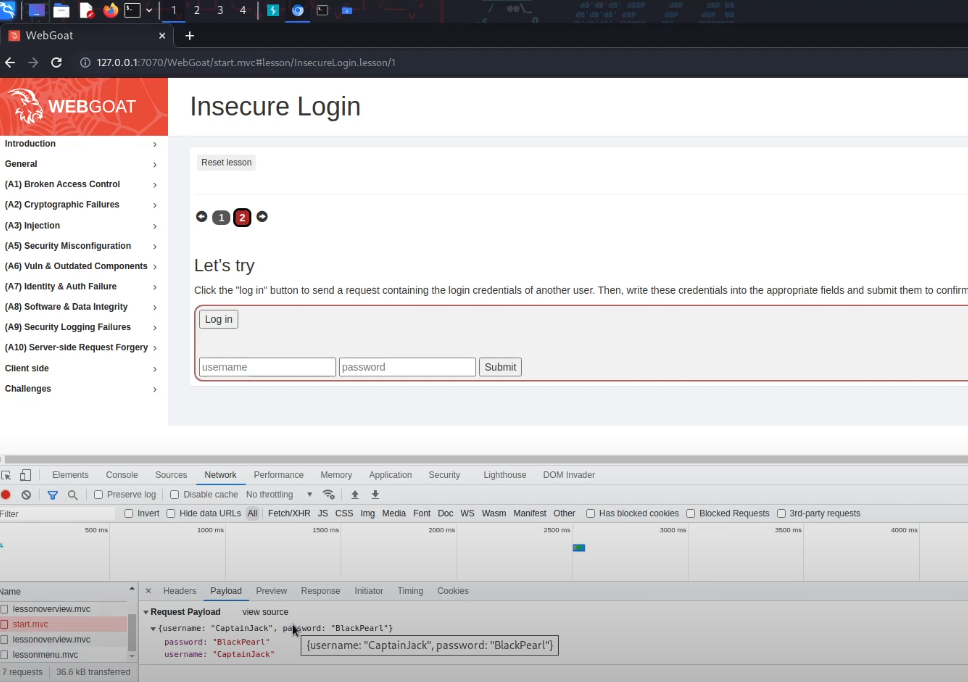

## Τι είναι το "Insecure Login";
Το μάθημα "Insecure Login" επικεντρώνεται σε προβλήματα που μπορεί να προκύψουν όταν μια διαδικασία σύνδεσης (login) δεν είναι σωστά σχεδιασμένη. Στόχος του μαθήματος είναι να δείξει πώς ένας επιτιθέμενος μπορεί να υποκλέψει ή να αποκτήσει πρόσβαση στα διαπιστευτήρια (username και password) ενός χρήστη, αν η εφαρμογή δεν προστατεύει σωστά αυτά τα δεδομένα.

### Βήματα:
1. **Η φόρμα σύνδεσης**:
   - Υπάρχει μια απλή φόρμα σύνδεσης με δύο πεδία: "username" (όνομα χρήστη) και "password" (κωδικός πρόσβασης).
   - Υπάρχει ένα κουμπί "Log in" για να στείλεις τα δεδομένα και ένα κουμπί "Submit" για να επιβεβαιώσεις την πρόκληση.

2. **Οδηγίες**:
   - Οι οδηγίες λένε: *"Click the 'log in' button to send a request containing the credentials of another user. Then, write these credentials into the appropriate fields and submit them to confirm."*  
     (Κάνε κλικ στο κουμπί 'log in' για να στείλεις ένα αίτημα που περιέχει τα διαπιστευτήρια ενός άλλου χρήστη. Μετά, γράψε αυτά τα διαπιστευτήρια στα κατάλληλα πεδία και υπέβαλέ τα για επιβεβαίωση).

3. **Παράθυρο του browser (Developer Tools)**:
   - Στο κάτω μέρος της εικόνας βλέπουμε τα **Developer Tools** του browser, συγκεκριμένα την καρτέλα "Network". Αυτή η καρτέλα δείχνει τις αιτήσεις (requests) που στέλνει η ιστοσελίδα όταν πατάς το κουμπί "Log in".
   - Στην αίτηση που έχει γίνει (`start.mvc`), βλέπουμε τα δεδομένα που στάλθηκαν:
     - `username: CaptainJack`
     - `password: BlackPearl`

## Τι μαθαίνουμε από αυτό;
Η συγκεκριμένη πρόκληση δείχνει μια κοινή ευπάθεια: τα διαπιστευτήρια στέλνονται **χωρίς κρυπτογράφηση** (σε απλό κείμενο, plain text). Αυτό σημαίνει ότι αν κάποιος επιτιθέμενος παρακολουθεί την κίνηση του δικτύου (π.χ. μέσω ενός εργαλείου όπως το Wireshark ή σε ένα μη ασφαλές δίκτυο Wi-Fi), μπορεί εύκολα να δει το όνομα χρήστη και τον κωδικό πρόσβασης.

### Πώς φαίνεται στην εικόνα;
- Όταν πατάς "Log in", η αίτηση που στέλνεται περιέχει τα δεδομένα `username=CaptainJack` και `password=BlackPearl` σε απλό κείμενο.
- Επειδή η σύνδεση δεν χρησιμοποιεί **HTTPS** (που κρυπτογραφεί τα δεδομένα) ή κάποια άλλη μέθοδο κρυπτογράφησης, τα δεδομένα είναι ορατά.

## Τι πρέπει να κάνεις στην πρόκληση;
1. Πατάς το κουμπί "Log in".
2. Βλέπεις τα διαπιστευτήρια (`CaptainJack` και `BlackPearl`) στην καρτέλα Network.
3. Τα γράφεις στα πεδία της φόρμας (username και password).
4. Πατάς "Submit" για να ολοκληρώσεις την πρόκληση.

## Πώς να διορθώσουμε αυτή την ευπάθεια;
Για να προστατεύσουμε μια διαδικασία σύνδεσης, πρέπει:
1. Να χρησιμοποιούμε **HTTPS** για να κρυπτογραφούμε την επικοινωνία μεταξύ του χρήστη και του διακομιστή.
2. Να αποθηκεύουμε τους κωδικούς πρόσβασης με **hashing** και **salting** στον διακομιστή (π.χ. χρησιμοποιώντας αλγορίθμους όπως bcrypt).
3. Να εφαρμόζουμε έλεγχο ταυτότητας με ασφαλή πρωτόκολλα, όπως το **OAuth** ή το **JWT** (JSON Web Tokens), αν χρειάζεται.

## Συμπέρασμα
Αυτή η πρόκληση στο WebGoat διδάσκει πώς μια ανασφαλής διαδικασία σύνδεσης μπορεί να οδηγήσει σε κλοπή διαπιστευτηρίων. Είναι ένα σημαντικό μάθημα για το πώς να σχεδιάζεις ασφαλείς εφαρμογές και να προστατεύεις τα δεδομένα των χρηστών. Αν θέλεις να μάθεις περισσότερα για κάποια συγκεκριμένη τεχνική (π.χ. HTTPS ή hashing), μπορείς να το ζητήσεις!
