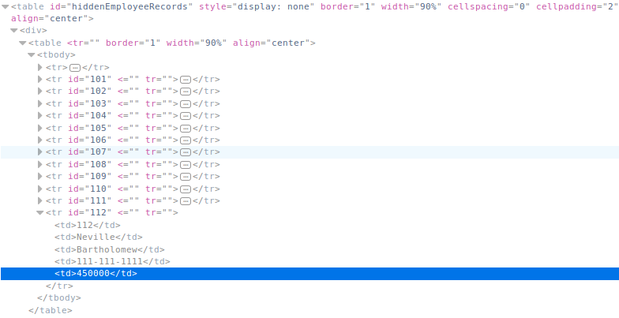

## 🔍 Client-side Filtering

Η απάντηση μπορεί εύκολα να εξαχθεί απλά εξετάζοντας τον κώδικα της ιστοσελίδας μέσω της προβολής του HTML source.

Συχνά, ευαίσθητες πληροφορίες (π.χ. κωδικοί, απαντήσεις, tokens) είναι ορατές στο HTML ή στο JavaScript.

---

## 🔓 Παράκαμψη Περιορισμών στο Front-end

### 🧾 Περιορισμοί Πεδίων (Field Restrictions)

Οι περιορισμοί που εφαρμόζονται σε πεδία φόρμας (π.χ. maxLength, pattern) μπορούν εύκολα να παρακαμφθούν αν τροποποιηθεί η HTTP αίτηση χειροκίνητα.

---

### ✅ Επικύρωση Εισόδου (Frontend Validation)

Ακόμα και η επικύρωση με JavaScript στο frontend μπορεί να παρακαμφθεί, τροποποιώντας απλώς τα δεδομένα που αποστέλλονται στην αίτηση.

> ⚠️ Η λογική ασφαλείας **ποτέ** δεν πρέπει να βασίζεται αποκλειστικά στο client side.

---

## 🛠️ HTML Tampering

Ο χρήστης μπορεί να αλλοιώσει το HTML ή τις τιμές του DOM με developer tools.

### Παράδειγμα:
Αλλαγή της ποσότητας σε τιμή πολύ μεγάλη ώστε να προκληθεί **float overflow**:

---

## ✅ Αντιμετώπιση

1. **Επαλήθευση και επικύρωση στο server-side**.
2. **Μη συμπερίληψη ευαίσθητων πληροφοριών στον client**.
3. **Μη βασίζεστε σε JavaScript για κριτικά σημεία ασφαλείας**.
4. **Αξιοποίηση Content Security Policy (CSP) για ενίσχυση του ελέγχου**.

---
