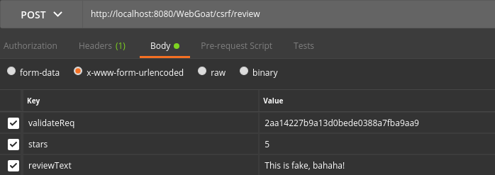

# Εισαγωγή στην CSRF

Η **CSRF** (Cross-Site Request Forgery, ή Παραποίηση Αιτήματος Διασταυρούμενης Τοποθεσίας) είναι ένας τύπος επίθεσης που εξαπατά έναν χρήστη να εκτελέσει ανεπιθύμητες ενέργειες σε μια εφαρμογή όπου είναι ήδη πιστοποιημένος. Αυτό συμβαίνει επειδή οι εφαρμογές εμπιστεύονται τα αιτήματα που προέρχονται από τον browser του χρήστη, εφόసον συνοδεύονται από έγκυρα cookies συνεδρίας.

---

## Πώς Λειτουργεί η CSRF

Όταν ένας χρήστης είναι συνδεδεμένος σε μια εφαρμογή, ο browser του στέλνει αυτόματα τα cookies συνεδρίας σε κάθε αίτημα προς την εφαρμογή. Ένας επιτιθέμενος μπορεί να δημιουργήσει ένα κακόβουλο αίτημα (π.χ., ένα URL ή μια φόρμα) και να το στείλει στο θύμα. Όταν το θύμα αλληλεπιδρά με αυτό το αίτημα (π.χ., κάνοντας κλικ σε ένα σύνδεσμο), ο browser στέλνει το αίτημα στην εφαρμογή μαζί με τα cookies του θύματος, και η εφαρμογή εκτελεί την ενέργεια σαν να την ζήτησε ο ίδιος ο χρήστης.

---

## Παραδείγματα CSRF Επιθέσεων

### 1. Βασική GET CSRF

Ο επιτιθέμενος τροποποιεί ένα URL για να συμπεριλάβει κακόβουλες παραμέτρους και το στέλνει στο θύμα. Για παράδειγμα:

```
/WebGoat/csrf/basic-get-flag?csrf=true&submit=Submit+Query
```

Όταν το θύμα κάνει κλικ στο σύνδεσμο, το αίτημα στέλνεται στην εφαρμογή με τα cookies του θύματος, και η εφαρμογή εκτελεί την ενέργεια.

### 2. CSRF με κλεμμένα cookies και validation key

Ο επιτιθέμενος υποκλέπτει ένα HTTP αίτημα για να κλέψει το cookie συνεδρίας (`SESSIONID`) και ένα validation key (`validateReq`). Στη συνέχεια, χρησιμοποιεί αυτά για να στείλει ένα POST αίτημα στην εφαρμογή, προσποιούμενος το θύμα.

Τα βήματα είναι:
- Υποκλοπή του αιτήματος για να πάρει το `SESSIONID` και το `validateReq`.
- Ρύθμιση του cookie στο HTTP client του επιτιθέμενου.
- Αποστολή POST αιτήματος με `Content-Type: application/x-www-form-urlencoded` και το `validateReq`.



### 3. CSRF και Content-Type

Ο επιτιθέμενος στέλνει ένα POST αίτημα σε `/WebGoat/csrf/feedback/message` με `Content-Type: text/plain`. Αν η εφαρμογή δεν ελέγχει τον τύπο περιεχομένου, μπορεί να δεχτεί το αίτημα, επιτρέποντας στον επιτιθέμενο να υποβάλει κακόβουλα δεδομένα.

### 4. Login CSRF Attack

Ο επιτιθέμενος δημιουργεί έναν λογαριασμό παρόμοιο με του θύματος (π.χ., `csrf-johndoe` αν το θύμα είναι `johndoe`). Στη συνέχεια, ενώ είναι συνδεδεμένος ως `csrf-johndoe`, εκτελεί μια ενέργεια. Όταν το θύμα συνδεθεί ως `johndoe`, η εφαρμογή αποδίδει την ενέργεια σε αυτόν, λόγω κακής διαχείρισης συνεδριών.

---

## Πρόληψη CSRF Επιθέσεων

Για να προστατευτείς από CSRF επιθέσεις, μπορείς να εφαρμόσεις τα εξής:

1. **CSRF Tokens**
   - Πρόσθεσε ένα μοναδικό token σε κάθε αίτημα.
   - Ο server ελέγχει το token πριν εκτελέσει την ενέργεια.

2. **Έλεγχος Content-Type**
   - Βεβαιώσου ότι η εφαρμογή δέχεται μόνο αιτήματα με αναμενόμενο `Content-Type`.

3. **SameSite Cookies**
   - Ρύθμισε τα cookies με `SameSite=Strict` ή `SameSite=Lax` για να περιορίσεις
